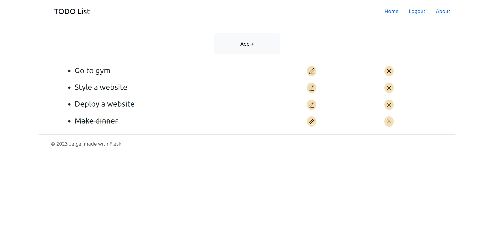
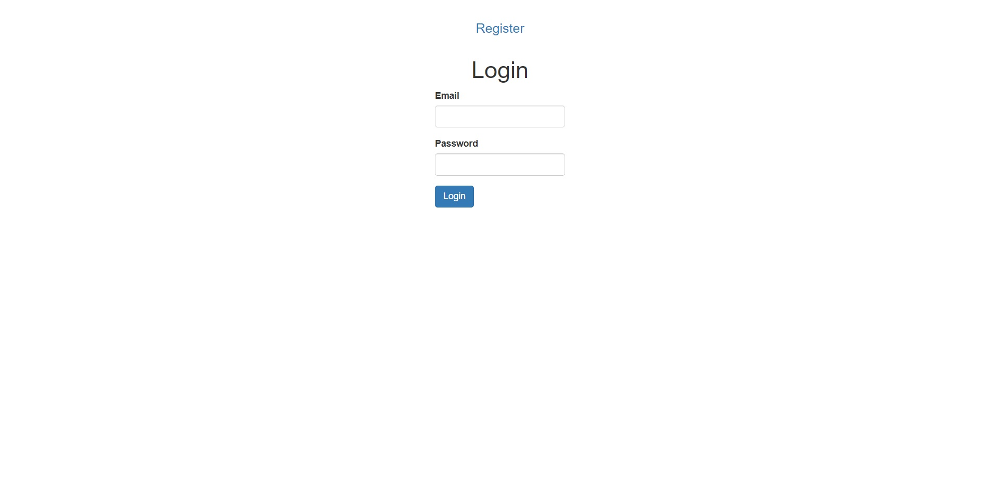
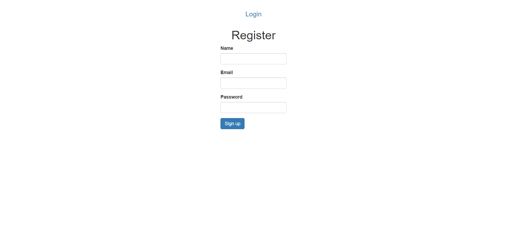

# To-do-list app created with Flask

To run the app do the following:
1. Clone the project
2. Get requirements
3. Make sure you got python v3.11 or higher

Then run next commands:
1. python server.py
2. on pycharm just press shift + f11 or click 'run' button

## Table of contents

- [Overview](#overview)
  - [The challenge](#the-challenge)
  - [Screenshot](#screenshot)
  - [Links](#links)
- [My process](#my-process)
  - [Built with](#built-with)
  - [What I learned](#what-i-learned)
  - [Continued development](#continued-development)
  - [Useful resources](#useful-resources)
- [Author](#author)
- [Acknowledgments](#acknowledgments)

## Overview

### The challenge

Users should be able to:

- View the optimal layout depending on their device's screen size
- See hover states for interactive elements

- See a list of all tasks
- Add a task
- Update a task
- Delete a task
- Register
- Login

### Screenshot

<p float="left">
  
  
  
</p>

### Links

- Repository URL: [Add solution URL here](hhttps://github.com/coder-96/to-do-list-django-fbv)

## My process

### Built with

Frontend:
- HTML5
- CSS
- Bootstrap 3.37
- Bootstrap 5

Backend:
- Flask
- SQLite

### What I learned

Improved my CRUD skills once again, and gained more knowledge overall on Python, Flask.

```python
login_manager = LoginManager()
login_manager.init_app(app)


@login_manager.user_loader
def load_user(user_id):
    return User.query.get(int(user_id))
```

### Continued development

I'm focused on perfecting my Full-Stack skills by building more projects.

### Useful resources

- [MDN Web Docs](https://developer.mozilla.org/en-US/) - helped me find answers when I got stuck.

## Author

- Website - [Jalga](https://github.com/coder-96)

## Acknowledgments

I thank my family for supporting me on my way to becoming a Developer. 